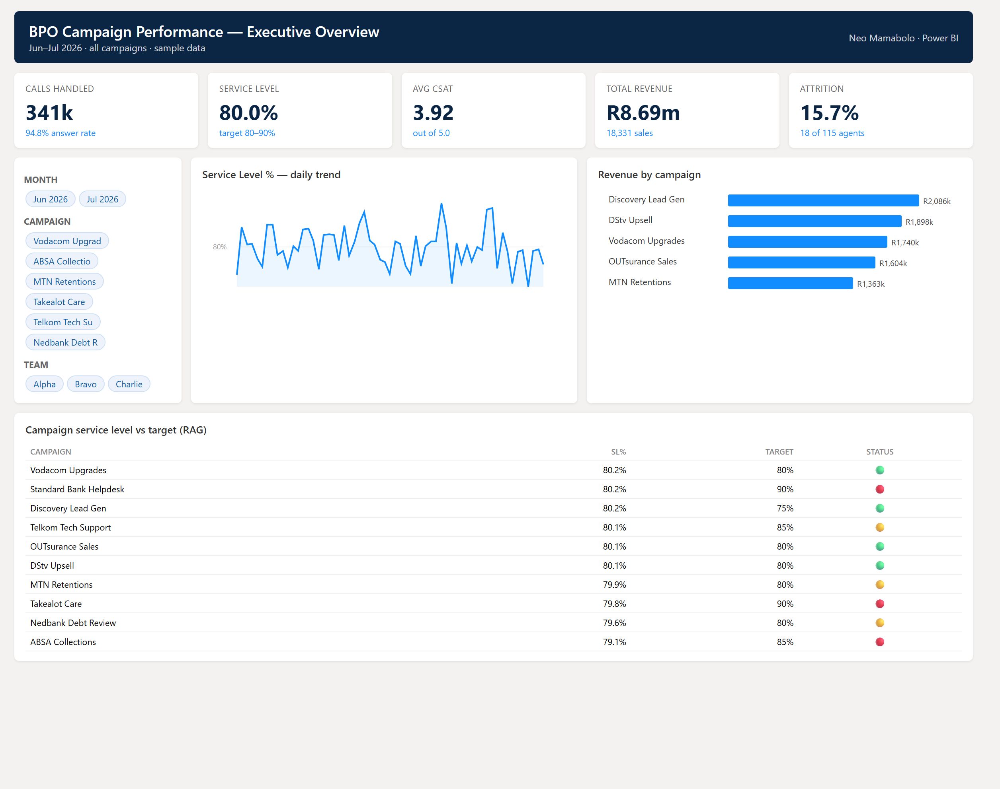

# 📈 Power BI — BPO Campaign Performance Dashboard

A Power BI project modelling a **multi-campaign contact-centre**: a clean star schema, a full DAX measures library, and a three-page report design (Executive Overview · Campaign Performance · Agent Scorecard).

> All data is synthetic sample data — no real people or clients.



*Design mockup of the Executive Overview page (built to spec — see [Build guide](./BUILD_GUIDE.md) to generate the live `.pbix`).*

---

## 🧱 Data model (star schema)

```
        dim_date ─────┐
                      │  (1 : many, on date)
 dim_campaign ──►  fact_daily_performance  ◄── dim_agent
     (on campaign_id)      │                    (on agent_id)
```

| Table | Grain | Key columns |
|---|---|---|
| [`dim_campaign`](./data/dim_campaign.csv) | one row per campaign | campaign_id, client, type, target_service_level, monthly_cost |
| [`dim_agent`](./data/dim_agent.csv) | one row per agent | agent_id, gender, team, campaign_id, hire_date, status |
| [`dim_date`](./data/dim_date.csv) | one row per day | date, month, weekday, is_weekend |
| [`fact_daily_performance`](./data/fact_daily_performance.csv) | **agent × campaign × day** | offered, handled, abandoned, handle_sec, SLA hits, CSAT, resolved, sales, revenue |

## 📐 Measures
20+ DAX measures across volume/efficiency, quality, sales, workforce, targets (RAG), time-intelligence and ranking — see **[DAX_measures.md](./DAX_measures.md)**.

## 🖥️ Report pages

**1 · Executive Overview** — KPI cards (Calls Handled, Service Level %, Avg CSAT, Total Revenue, Attrition %), service-level trend line, revenue-by-campaign bar, campaign RAG table, month + campaign slicers.

**2 · Campaign Performance** — cost vs revenue and margin by campaign, service level vs target with RAG, conversion funnel, AHT and abandon-rate cards.

**3 · Agent Scorecard** — ranked agent table (RANKX), CSAT vs campaign average, calls/AHT scatter, coaching flags, team & campaign slicers.

## 🛠️ Build it
See **[BUILD_GUIDE.md](./BUILD_GUIDE.md)** — import the CSVs, set the relationships, paste the measures, and lay out the visuals to reproduce the report and export a live `.pbix`.

## Skills shown
Star-schema modelling · DAX (`DIVIDE`, `CALCULATE`, `RANKX`, `SWITCH`, time-intelligence) · KPI dashboard design · RAG reporting · slicers & drill-through.
